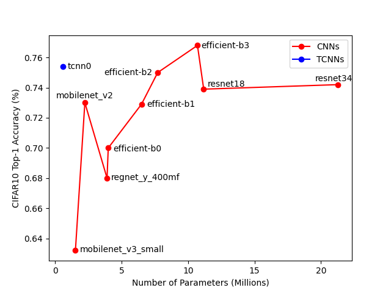
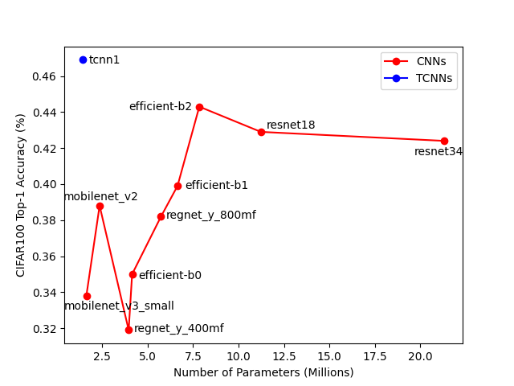

# Tensor-Conv
Tensor-based Convolutions show higher efficiency than current popular netwroks like, ResNet, MobileNet, EfficientNet, etc. Note that No data augmentaion techniques (resizing, fliping, cropping, etc.) are used. 

The result on CIFAR10            |  The result on CIFAR100
:-------------------------:|:-------------------------:
  |  
