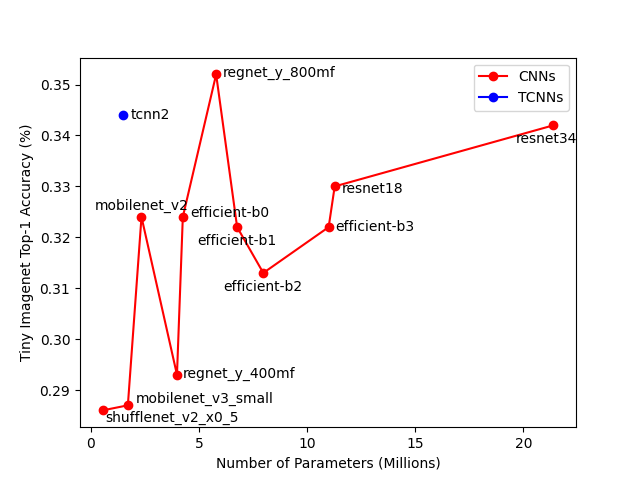

# Tensor-Conv
Neural Tensor-based Convolutional Neural Networks show higher efficiency than current popular netwroks like, ResNet, MobileNet, EfficientNet, etc. Note that No data augmentaion techniques (resizing, fliping, cropping, etc.) are used. 

The result on CIFAR10            |  The result on CIFAR100
:-------------------------:|:-------------------------:
  |  

The result on Tiny ImageNet    |       
:-------------------------:
 |

Also, TCNNs show higher robustness compared to normal ConvNets, 
The result on CIFAR10    |       
:-------------------------:
 |
